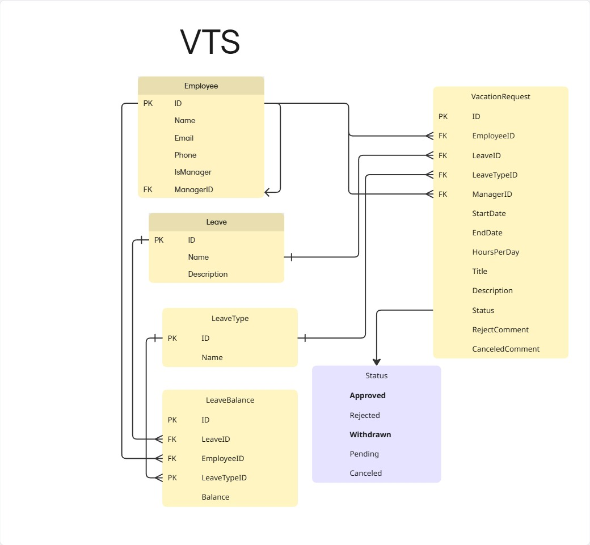
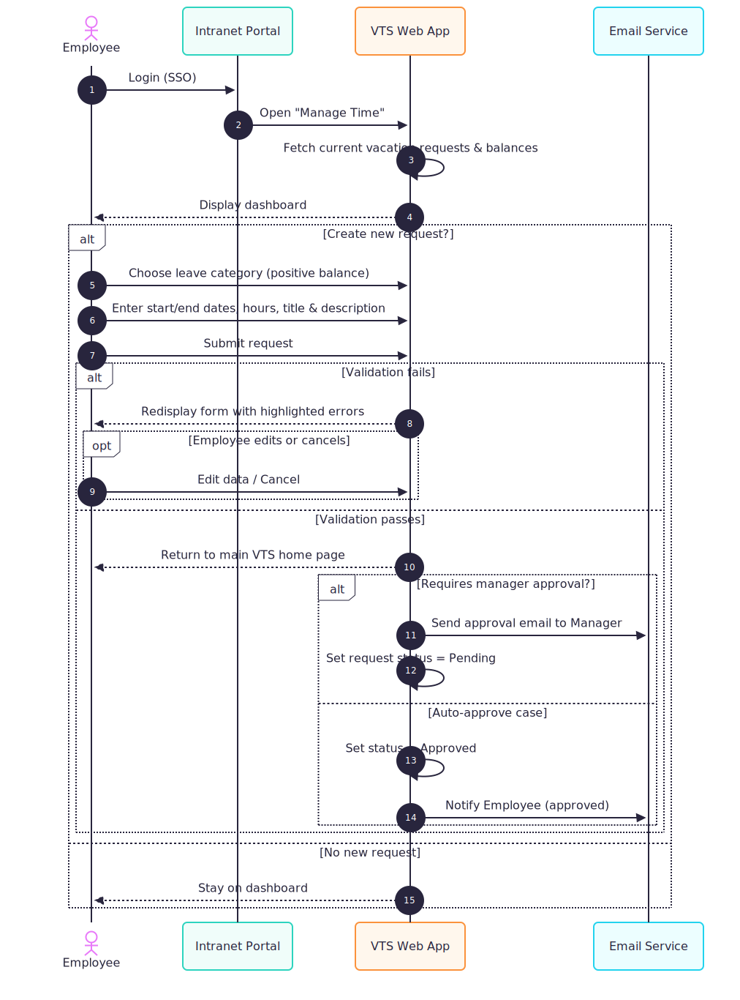

# VTS - Vacation Tracking System

## Overview

The Vacation Tracking System (VTS) is a workflow application that streamlines vacation request submission and manager approval. It provides clear process flows, role-based permissions, auditability, and integrations with internal systems.

## Project Structure

```
VTS/
├── README.md
├── VTS_ERD.jpg
├── session_01/
│   ├── 01_Sequence_Employee.svg
│   ├── 02_Sequence_Manager.svg
│   ├── VTS.pdf
│   └── VTS_Flow_chart.svg
└── session_02/
    ├── UI of Requests (Employee).png
    └── UI of Requests (Manager).png
```

## Sessions

### Session 01: Diagrams & Documents

- Entity-Relationship Diagram (ERD)
  

- Sequence: Employee submits a new request
  

- Sequence: Manager approval flow
  

- System flow chart
  

- Session 01 PDF: [Open Document](./session_01/VTS.pdf)

#### Summary from Session 01 (PDF)

- Vision:

  1. Develop and deploy a flexible vacation time management application for managers and employees.
  2. VTS enables employees to manage vacation, sick leave, and personal time off without needing expertise in company or local leave policies.

- Function:

  1. Manager Approval: Enables manager approval (optional).
  2. Request Access Range: Access previous calendar year requests and submit requests up to 18 months in the future.
  3. Email Notifications: Notify managers for approvals and employees for status changes.
  4. HR and System Admin Overrides: Allow overrides with logging by HR and system administration.
  5. Manager Awarding Personal Leave: Managers can award personal leave time with system-set limits.
  6. Web Service Interface: Internal systems can query an employee’s vacation request summary.

- Non-Functional:

  1. The app must be a web application.
  2. Manager approval is optional.

- Constraints:

  1. Consider existing and proposed systems context.
  2. Deliver functionality as a web application.
  3. Use existing hardware and middleware.
  4. Extend the intranet portal, using single-sign-on (SSO) for authentication.
  5. Keep activity logs for all transactions.
  6. Interface with HR legacy systems to retrieve and update employee information.

- Domain:
  Leave management is currently manual, causing delays, errors, and extra HR workload.

- Pseudocode:

```
START
● Employee logs into the internal portal
● Display balances: previous 6 months and up to 18 months ahead
IF employee wants to create a new request
  IF balance > 0
    Enter title, description, time, and date
    IF data is valid
      Return to the new page
      IF manager approval needed
        Send notification to manager for approval
        Set state = pending approval
    ELSE
      Set state = pending approval
      Show error message
      Correct data or cancel request

IF manager
  ● Manager clicks the email link OR logs into the portal
  ● Homepage shows manager’s leave requests and a section for pending approvals
  ● Manager reviews each request to approve or deny
  ● Show details of requested time
  IF accepted
    Change state
  ELSE
    Enter explanation
    Change state
  ● Send email notification to the employee
```

- Actors:
  1. Employee: Primary user to manage vacation time.
  2. Manager: Has employee capabilities plus approves subordinates’ vacation requests and may award comp time within limits.
  3. Clerk (HR): Can view and maintain employee data; can add/remove records; may use separate login IDs when also an employee.
  4. System Admin: Ensures smooth operation of technical resources and manages log files.

### Session 02: User Interfaces

- Employee Requests UI
  .png>)

- Manager Requests UI
  .png>)

## What if we need to have in the future another status like HR_Pending, HR_Approval with minimum change?

- Add HrID to the VacationRequest Table
- Add these two statuses to the status Enum

## Pseudocode For Withdraw Request:

```
START
  function withdrawRequest(request) {
    if(request.status === 'Pending') {
      var confirmWithdraw = showConfirm("Confirm Message")
      if(confirmWithdraw) {
        updateRequest(request)
        sendEmailToManager(managerID, Message)
      }
    }
  }

  function updateRequest(request) {
   // Code to send email to manager
  }

  function sendEmailToManager(managerID, message) {
    // Code to send email to manager
  }

  function showConfirm(message) {
    // Code to show confirm dialog
  }
```

## Pseudocode For Cancel Approved Request:

```
START
  function CancelRequest(request) {
      if(request.status === 'Approved') {
        var confirmCancel = showConfirm("Confirm Message")
        if(request === in the future) {
          confirmCancel = showConfirm("Confirm Message")
          if(confirmCancel) {
            updateRequest(request)
            sendEmailToEmployee(employeeID, "Message")
          }
        } else if (request === in the recent past (pre vious 5 business days)) {
          confirmCancel = showConfirm("Confirm Message")
          var enterExplanation = enterMessage("Enter Explanation")
          if(confirmCancel) {
            updateRequest(request)
            sendEmailToEmployee(employeeID, "Message")
          }
        }

        ReturnBalanceToEmployee(employeeID, request.balance)
    }
  }

  function ReturnBalanceToEmployee(employeeID, balance) {
    // Code to return balance to employee
  }

    function showConfirm(message) {
    // Code to show confirm dialog
  }

  function enterMessage(message) {
    // Code to show enter dialog
  }

  function updateRequest(request) {
    // Code to update request
  }

  function sendEmailToEmployee(employeeID, message) {
    // Code to send email to employee
  }
```

## Pseudocode For Edit Pending Request:

```
START
  function editPendingRequest(request) {
    if(request.status === 'Pending') {
      changeRequest(request)
    }
  }

  function changeRequest(request) {
   // Code to send email to manager
   // change title, comments or dates
  }
```
